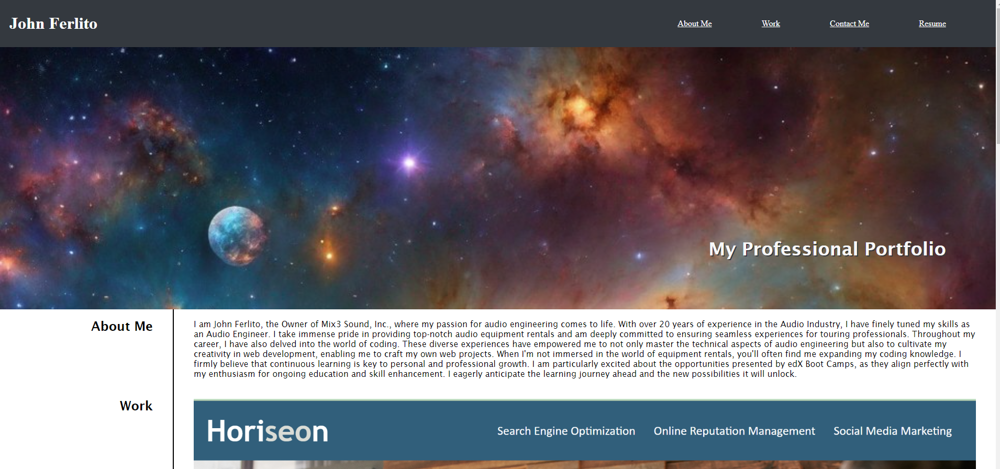

# challenge2-Portfolio

## Description

This project is a personal portfolio website designed to showcase my professional skills, projects, and experiences. It serves as a digital resume and a platform where potential employers and collaborators can learn more about my work and get in touch with me.

In today's digital age, having an online presence is crucial. A personal portfolio allows me to:

- Present my work in a visually appealing and organized manner.

- Highlight key projects and achievements that demonstrate my capabilities.

- Increase my visibility to potential employers, clients, and collaborators.

- Provide a single, easily accessible point of reference for my professional information.
- The portfolio is built using modern web technologies to ensure responsiveness and a smooth user experience. Here are the key steps and tools involved:

Planning and Design:

Sketch initial wireframes and design the layout using tools like Figma.

Development:

- Use HTML, CSS to create the structure and interactivity of the site.

- Implement responsive design principles to ensure the site looks great on all devices.

Content Creation:

- Include high-quality images, screenshots to visually represent the work.

- Create an "About Me" section that outlines my background, skills, and career goals.

Deployment:

- Host the website using a reliable service such as GitHub Pages.

## Usage

**Repo**

[Github Repo](https://github.com/jjfcode/challenge2-Portfolio)

**Link of the web Page:**

[Github Page](https://jjfcode.github.io/challenge2-Portfolio/)

## Credits

I used [W3schools](https://www.w3schools.com/) to check some elements and [Professional README Guide](https://coding-boot-camp.github.io/full-stack/github/professional-readme-guide) and [CHAT & ASK AI](https://askaichat.app/) for help on my README.
 
## License

🏆 The previous sections are the bare minimum, and your project will ultimately determine the content of this document. You might also want to consider adding the following sections.

